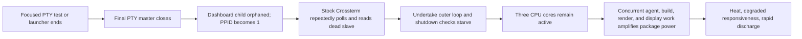

# Executive Summary

On 2026-07-25, three abandoned `undertake dashboard` processes each consumed roughly one CPU core after their final PTY master disappeared. The Undertake root cause was Crossterm 0.28.1's Unix event-source loop: EOF or macOS `EIO` left the dead slave perpetually readable, and the dependency retried `read(2)` without returning to Undertake. Final PTY closure after focused release-test/reviewer-launcher termination was the trigger. Twelve concurrent coding sessions and active OMP/Bun, Codex, Herdr, Ghostty, WindowServer, builds, and tests amplified host load; concurrency was not the root cause.

Commit `5afd81f` vendors Crossterm 0.28.1 with the three relevant upstream fixes and makes terminal disconnect a narrow graceful-exit condition. Three fixed release-PTY reruns passed at both 250 ms and 60,000 ms refresh settings. A stock-dependency control built from the same commit also exited successfully in three fresh attempts, so the isolated control did not reproduce the scheduler-dependent live failure; it does not erase the three contemporaneous process stacks and counters. No additional product source change was justified.

# Incident Metadata

| Field | Value |
|---|---|
| Date | 2026-07-25 |
| Local timezone | America/Chicago (`-05:00`) |
| Affected host | macOS 26.5, Apple silicon |
| Affected component | `undertake dashboard`, Crossterm 0.28.1 Unix MIO event source |
| Selected run | `run-work-20260725T183920.469500000-p45813-000000` |
| First known runaway launch | 2026-07-25 20:56:32-05:00 |
| Containment | Exact-PID `KILL` after bounded `TERM` failed, approximately 22:47-22:54-05:00 |
| Corrective commit | `5afd81f` (`fix: exit dashboard when terminal disappears`) |
| Last pre-fix dashboard revision | `0321f30` |
| Severity | Severe local resource exhaustion; no data-integrity or remote-service incident established |

# User Impact

The Mac became hot, battery discharged rapidly, and interactive work became degraded during a period with twelve coding sessions and multiple active terminal/rendering workloads. Three invisible abandoned dashboard viewers continued to use about three cores indefinitely. No evidence shows that they performed useful run refresh, model dispatch, network activity, or file supervision after terminal loss.

# System Impact

At the 21:58-21:59 user-supplied peak snapshot, memory usage was about 123 GB with about 4 GB free and zero swap. Load, CPU use, and UI activity were high across several independent processes. Immediately before containment, the three Undertake processes each accounted for about 67-71% CPU in a `top` interval. At about 22:54, after exact-PID removal, the system was about 75% idle. This proves a large persistent Undertake contribution, not exclusive ownership of all CPU, battery, GPU, disk, or network use.

No contemporaneous process-coalition energy trace, `powermetrics`, `fs_usage`, `nettop`, output-byte counter, or per-process GPU trace exists for the peak. A later 3.6 W CPU+GPU+ANE sample is post-incident context and cannot be projected backward.

# Detection

The incident was detected through user-observed heat, rapid discharge, and degraded responsiveness, followed by a user-supplied process snapshot. Live investigation then found three matching `undertake dashboard` processes with PPID 1, missing PTY masters, high CPU, rapidly growing syscall/message counters, and main threads almost entirely in `read(2)`.

# Timeline

All local timestamps use `-05:00`. UTC log timestamps were converted to America/Chicago.

| Time | Event | Evidence |
|---|---|---|
| 20:21:29 | First final-review OMP job began. | Final-review session JSONL; job later timed out after 60 minutes. |
| 20:56:32 | PID 21520 launched. | Live `ps -ww`; executable and argv matched the release PTY fixture. |
| 20:59:28 | PID 44428 launched. | Live `ps -ww` elapsed/start data. |
| 21:21:51 | Final-review retry began. | Final-review session JSONL; runtime about 53 minutes. |
| 21:41:27 | PID 31742 launched. | Live `ps -ww` elapsed/start data. |
| 21:58-21:59 | Peak user snapshot showed high system load, active agent/render processes, 123 GB used memory, and rapid battery loss. | User-supplied telemetry embedded in the investigation JSONL; original capture file unavailable. |
| 22:27-22:43 | Live process, descriptor, counter, and stack evidence captured. | Investigation JSONL and `/tmp/undertake_2026-07-25_*.sample.txt`. |
| 22:31:26 | Commit `5afd81f` landed the dead-TTY fix and bounded regressions. | Git history. The three live processes started before this commit. |
| About 22:47 | Final measurements showed each Undertake process at about 67-71% CPU. Bounded `TERM` did not remove them. | Investigation JSONL. |
| About 22:47-22:54 | Exact-PID `KILL` removed only the three confirmed runaways. | Investigation JSONL and subsequent empty exact-PID checks. |
| 22:54 | Host measured about 75% idle. | Post-containment `top`. |
| 22:58 | Herdr sampled after Undertake containment. | `/tmp/herdr_2026-07-25_225842_To6O.sample.txt`; post-incident only. |

The final-review JSONL does not record child PIDs and does not contain the focused test name. Therefore exact PID-to-test assertion ownership is unknown. The bounded conclusion is that all three commands match the dashboard release-PTY fixture and their launches fall within the two reviewer-job lifetimes.

# Evidence Collected

## Per-process evidence

| PID | Start | PPID / PGID | TTY | Executable and argv | Descriptors | Stack | Counters / last CPU |
|---:|---|---|---|---|---|---|---|
| 21520 | 20:56:32 | `1 / 21520` | `/dev/ttys014` | `.worktrees/undertake-dashboard/target/release/undertake dashboard --run run-work-20260725T183920.469500000-p45813-000000 --refresh-ms 250 --config …/undertake.toml` | Dead slave plus kqueue, wake pipe/socket, image, loader; no network socket | 3,881/3,889 main-thread samples in `read(2)` | 8,328,318 cumulative BSD syscalls and 13,199,862,900 received messages at one capture; one-second deltas about 90,395,789 syscalls and 659,044,300 messages; about 67-71% final interval |
| 31742 | 21:41:27 | `1 / 31742` | `/dev/ttys028` | Same executable and argv | Same descriptor shape; no PTY master or network socket | 2,537/2,552 samples in `read(2)` | Same rapidly growing pattern; about 67-71% final interval |
| 44428 | 20:59:28 | `1 / 44428` | `/dev/ttys018` | Same executable and argv | Same descriptor shape; no PTY master or network socket | 2,537/2,548 samples in `read(2)` | Same rapidly growing pattern; about 67-71% final interval |

macOS `ps` on this host rejected the requested `sid` field; no session ID is invented. Each process had its own process group and foreground terminal process-group ID. PPID 1 means the launcher/reaper disappeared and launchd adopted the child; it does not mean launchd intentionally supervised Undertake.

## Wider-process evidence

| Component | Observed responsibility | Attribution limit |
|---|---|---|
| Undertake | Three dead-TTY loops consumed about three cores and drove extreme reads/syscalls/messages. | No live sockets; no evidence of model work, file watching, or useful refresh. |
| OMP/Bun | Launched reviewer/test workloads and other coding sessions; reviewer lifetimes overlap all three launches. | No child-PID records; exact assertion ancestry unknown. |
| Herdr | Multiplexed PTYs and rendered terminal state. Post-containment stack shows render/diff/frame serialization and Ghostty-buffer work while PTY actors otherwise blocked in `poll`. | The 22:58 sample does not quantify the 21:58 peak. |
| Ghostty / WindowServer | Displayed terminal and application frames. | Dead Undertake slaves had no master and emitted no useful frames; no direct causal claim from their inner loop to WindowServer. |
| Codex Service / Renderer | Independently active GUI coding work. | No evidence connects its work to Undertake's loop. |
| Builds, tests, language tooling | Release compilation/tests and diagnostics were active. | Transient CPU/disk contributor; not the persistent loop. |
| Memory | 123 GB used, 4 GB free, zero swap in supplied peak snapshot. | Capacity/pressure context, not proof of CPU causation. |
| Network, disk, GPU, battery | Global activity and rapid discharge observed. | Per-process shares unresolved. |

## Local artifacts

- Investigation transcript: `~/.omp/agent/sessions/-git-undertake/2026-07-26T03-22-04-981Z_019f9c71-b335-7000-a239-71e1c54a0eb1.jsonl`.
- Reviewer transcript: `~/.omp/agent/sessions/-git-undertake/2026-07-25T17-32-25-256Z_019f9a55-d928-7000-a9e5-b9414e05915c.jsonl`.
- Undertake samples: `/tmp/undertake_2026-07-25_222737_lTYT.sample.txt`, `/tmp/undertake_2026-07-25_224252_oMA8.sample.txt`, and `/tmp/undertake_2026-07-25_224303_x3Tz.sample.txt`.
- Herdr sample: `/tmp/herdr_2026-07-25_225842_To6O.sample.txt`.
- Run fixture: `~/.local/state/undertake/runs-v2/run-work-20260725T183920.469500000-p45813-000000/`.
- Source: `src/dashboard/runtime.rs`, `src/process.rs`, and `vendor/crossterm-0.28.1/src/event/source/unix/`.

The peak snapshot is user-supplied telemetry whose original capture file is unavailable. Live commands and their outputs are preserved in the investigation JSONL. No sensitive session content is reproduced here.

# Technical Analysis

Stock Crossterm 0.28.1's Unix MIO source receives readiness for the terminal and enters an inner `loop`. A positive read advances the parser. `WouldBlock` breaks; `Interrupted` retries. Zero-byte EOF does neither, and macOS terminal-loss `EIO` is also not returned. The dead slave remains readable, so MIO immediately reports readiness and the code repeatedly calls `read(2)`.

Undertake's outer dashboard loop normally uses a bounded event poll, observes its shutdown atomic, refreshes run state, renders, and restores the terminal during cleanup. The dependency loop prevented control from returning to any of those stages. This maps directly to the samples: almost every main-thread sample was in kernel `read`, not JSON parsing, rendering, network I/O, or run scanning.

Commit `5afd81f` backports the relevant behavior from Crossterm PR [#1067](https://github.com/crossterm-rs/crossterm/pull/1067), associated with issue [#793](https://github.com/crossterm-rs/crossterm/issues/793):

1. Unix MIO converts zero-byte reads and macOS `EIO` into `UnexpectedEof`.
2. The `/dev/tty` source applies the same terminal-loss semantics.
3. Cursor-position polling propagates errors instead of treating them as retryable absence.

Undertake recognizes only `UnexpectedEof`, `BrokenPipe`, and Unix `EIO` as graceful disconnects. Other I/O errors remain failures. Returning control allows terminal restoration, service cancellation/join, and process-group cleanup.

TERM was ineffective during the incident because Undertake's handler set the shutdown atomic, but the main thread never escaped Crossterm's inner loop to observe it. Exact-PID KILL was therefore required for containment.



# Root Cause

**Root cause:** Crossterm 0.28.1's Unix dead-TTY retry semantics trapped each dashboard in a permanently readable `read(2)` loop. Without that defect, three abandoned viewers would not have burned roughly three cores indefinitely.

# Trigger

**Trigger:** final PTY-master closure after the focused release-test/reviewer launcher ended while dashboard children survived their launcher/reaper. Losing ancestry caused reparenting to PID 1; losing the terminal activated the faulty dependency path.

# Contributing Factors

- Twelve concurrent sessions exposed and amplified the defect; concurrency itself was not the root cause.
- Reviewer timeout/cancellation did not guarantee complete descendant process-group cleanup.
- Legitimate OMP/Codex/build/test work created substantial transient CPU and disk demand.
- Herdr, Ghostty, and WindowServer performed independent PTY, render, serialization, and display work.
- High memory occupancy reduced system headroom.
- No host-wide advisory resource budget existed.
- Missing structured dashboard lifecycle/provenance records delayed PID-to-launch correlation.

**Symptoms:** high load, high CPU, read/syscall/message storms, heat, UI activity, and rapid battery loss.

**Unproven hypotheses:** exact joule attribution, peak per-process GPU/disk/network shares, direct causation of WindowServer activity by the runaways, and exact PID-to-test ownership. These remain unknown.

# What Went Well

- Live exact-PID process, descriptor, counter, and stack evidence was captured before containment.
- Containment targeted only confirmed processes.
- Source and upstream history matched all three stacks.
- The fix addresses dependency EOF/EIO semantics rather than masking CPU symptoms.
- Bounded PTY regressions now cover both refresh extremes and post-hangup signals.

# What Went Poorly

- Test/reviewer teardown allowed descendant dashboards to survive launcher termination.
- PPID 1 destroyed direct ancestry without a correlation record.
- TERM could not be observed while the dependency loop held control.
- No peak process-energy, GPU, disk, network, or output-byte telemetry existed.
- The stock-control failure was not deterministic in three post-incident reruns, limiting isolated reproduction strength.

# Immediate Mitigation

The three confirmed dashboard PIDs received TERM, were allowed a bounded two-second cleanup opportunity, then only survivors received exact-PID KILL. Subsequent checks found no matching processes, and the host returned to about 75% idle. Low Power Mode reduces package power but is mitigation only; it neither repairs EOF handling nor cleans orphan descendants.

# Corrective and Preventive Actions

| Category | Action | Rationale | Priority | Owner | Target date | Verification method | Status |
|---|---|---|---|---|---|---|---|
| Immediate containment | For a confirmed dead-TTY spin, send TERM to exact PIDs, wait two seconds, then KILL only survivors | TERM should permit ordinary cleanup; the incident loop can starve signal observation, so bounded escalation is required | P0 | Incident operator | 2026-07-25 | Exact PID list is empty; post-containment sample shows the processes gone | Complete |
| Short-term defect fixes | Retain the three Crossterm #1067 backports and Undertake's narrow terminal-disconnect handling | Corrects EOF/EIO semantics at the source and returns control to cleanup | P0 | Undertake maintainer | 2026-07-25 | Isolated stock/patched A/B plus focused release PTY test | Complete in `5afd81f`; fixed rerun passed, stock rerun did not reproduce |
| Short-term defect fixes | Run the 250/60000 ms PTY-master-close and post-hangup signal regressions on macOS CI; assert process-group cleanup | Prevents platform-specific regression and test-created orphans | P0 | Undertake maintainer | 2026-08-01 | CI closes final PTY master, observes exit ≤2 s, and finds no descendant | Proposed; no repository CI workflow found |
| Short-term defect fixes | Make OMP/harness timeout, cancel, and failed-test teardown kill/reap the complete descendant process group and verify zero survivors | The faulty child persisted because launcher completion did not contain descendants | P1 | OMP/harness maintainer | 2026-08-08 | Integration test creates a grandchild, times out parent, and proves no descendant remains | Proposed; cross-repo |
| Observability improvements | Emit structured dashboard start/exit records with PID, PPID, PGID/SID, tty, run ID, refresh, build hash, launcher/session correlation ID, and exit reason | Restores provenance that PPID 1 destroys | P1 | Undertake maintainer | 2026-08-15 | Lifecycle test validates start and exit records for quit, signal, and disconnect | Proposed |
| Observability improvements | Add a read-only `undertake doctor` view for stale/orphan dashboards, run/worker ownership, terminal state, and sustained high CPU | Reduces time to identify and contain future orphaned work | P2 | Undertake maintainer | 2026-08-31 | Fixture plus live-process smoke test identifies an orphan without terminating it | Proposed |
| Long-term architectural improvements | Benchmark Herdr with 1/4/12 active panes; cache stable repository/display metadata and coalesce dirty renders/frame serialization only where profiles justify it | Herdr independently performed render/diff/serialization work; exact peak energy share is unknown | P1 | Herdr maintainer | 2026-08-15 | Before/after profile reports render CPU, frame rate, bytes, and latency under the same pane workload | Investigation proposed; cross-repo |
| Long-term architectural improvements | Design an opt-in host-level dispatch budget/advisory spanning harnesses, using active jobs, load, battery source/charge, and memory pressure | Adds backpressure for legitimate concurrency but must not hide runaway defects | P2 | Harness platform owner | 2026-09-15 | Controlled 12-session load defers new dispatch while interactive work remains responsive | Design proposed; cross-repo |
| Long-term architectural improvements | Replace vendored Crossterm only when an upstream release includes all three fixes | Avoids permanent fork maintenance without reintroducing #793 | P2 | Undertake maintainer | Upstream release + 14 days | Dependency tree uses the release and complete PTY suite passes | Blocked on upstream release |
| Documentation or operating guidance | Document diagnosis/containment and dashboard completion/parent/terminal lifecycle | Prevents Low Power Mode or indiscriminate killing from being mistaken for a fix | P1 | Undertake maintainer | 2026-08-01 | Runbook walkthrough identifies exact PIDs and follows bounded TERM→KILL escalation | Proposed |

Evaluated and rejected or deferred:

- Undertake already blocks in its outer event wait; the defect was an inner dependency loop.
- Polling backoff would mask, not repair, EOF semantics.
- Auto-exit on run completion violates the read-only viewer contract.
- Parent-death exit is ambiguous under PTY multiplexers; terminal loss is the proven signal.
- A dashboard singleton or global Undertake concurrency cap would not govern independent OMP/Codex sessions and would not fix one process spinning.
- CPU watchdogs, self-termination, and output limits need workload baselines and false-positive design.
- Worker heartbeat expiration does not apply to an interactive viewer that may intentionally outlive its launcher.

# Validation Plan

## Dependency-isolated release-PTY matrix

Both variants used commit `5afd81f`; only the `[patch.crates-io]` override differed.

| Variant | Runs | Refresh settings | Result | Interpretation |
|---|---:|---|---|---|
| Stock crates.io Crossterm 0.28.1 | 3 | 250 and 60,000 ms per run | All passed; child exited within two seconds | The live failure did not reproduce in this short scheduler-dependent control. This is a limitation, not positive proof for stock behavior. |
| Vendored fixed Crossterm 0.28.1 | 3 | 250 and 60,000 ms per run | All passed; no descendant remained | Fixed boundary behavior is repeatable. |

Vendored unit regressions freshly passed: MIO EOF (1), `/dev/tty` EOF (1), and cursor poll-error propagation (1). `cargo tree --features tui -i crossterm@0.28.1` resolved exactly one package, the vendored path.

## Fresh repository verification

- `cargo test --features tui closed_terminal_exits_at_both_refresh_extremes -- --nocapture`: 1 passed in each of three fixed runs.
- `cargo test --features tui dashboard::runtime::tests`: 7 passed.
- `cargo test --features tui`: 828 passed, 8 ignored after local integration with concurrent `main` work (801 passed, 8 ignored on the feature branch).
- `cargo test --no-default-features`: 633 passed, 8 ignored after local integration (606 passed, 8 ignored on the feature branch).
- `cargo clippy --all-targets --all-features -- -D warnings`: passed after two narrow test-only cleanup edits (`unused_mut` removal and deduplicating a CLI fixture configuration). Vendored Crossterm emits dependency warnings that Cargo does not promote through the root package's `-D warnings`.

## Bounded scenario measurements

The disposable runner used independent copied state roots, one PTY per dashboard, exact process-group cleanup in `finally`, 1 Hz CPU samples, FD counts, and terminal-output byte counts. It dispatched no providers. CPU values are observed distributions, not pass thresholds. Power settings were recorded without mutation: AC power was attached at 80%; battery `powermode=1`, AC `powermode=0`. A comparable normal/Low Power pair was not practical without altering system settings.

| Scenario | Count | Refresh | Duration | CPU median / max | FDs | Output bytes | Exit outcome |
|---|---:|---:|---:|---:|---:|---:|---|
| Idle | 1 | 250 ms | 30 s | 0.45% / 0.9% | 9 | 5,894 | Viewer alive and usable; bounded cleanup passed |
| Idle | 1 | 60,000 ms | 30 s | 0.0% / 0.1% | 9 | 5,954 | Viewer alive and usable; bounded cleanup passed |
| Fixture updates | 1 | 250 ms | 30 s | 0.5% / 0.9% | 9 | 5,894 | Viewer alive; bounded cleanup passed |
| Idle scaling | 1 | 250 ms | 30 s | 0.55% / 0.9% | 9 | 5,894 | Bounded cleanup passed |
| Idle scaling | 4 | 250 ms | 30 s | 2.1% / 3.5% | 42 | 23,816 | Bounded cleanup passed |
| Idle scaling | 12 | 250 ms | 30 s | 6.5% / 9.8% | 178 | 70,808 | Bounded cleanup passed |
| Update scaling | 1 | 250 ms | 30 s | 0.5% / 0.9% | 11 | 5,914 | Bounded cleanup passed |
| Update scaling | 4 | 250 ms | 30 s | 2.25% / 3.7% | 42 | 23,896 | Bounded cleanup passed |
| Update scaling | 12 | 250 ms | 30 s | 6.6% / 10.0% | 174 | 71,108 | Bounded cleanup passed |
| Completed fixture | 1 | 250 ms | 2 s | 0.3% / 0.6% | 9 | 394 | Remained usable until cleanup, as designed |
| Abandoned fixture | 1 | 250 ms | 2 s | 0.15% / 0.3% | 9 | 394 | Remained usable until cleanup, as designed |
| Disconnected PTY | 1 | 250 ms | bounded | n/a | n/a | readiness only | Exited in 0.021 s |
| Disconnected PTY | 1 | 60,000 ms | bounded | n/a | n/a | readiness only | Exited in 0.025 s |
| Parent gone, master retained equivalent | 1 | 250 ms | 1 s | n/a | n/a | 194 | Remained usable; explicitly cleaned |

The 1→4→12 CPU and output growth was approximately linear, not superlinear. No scenario approached a persistent full core per dashboard. The runner did not capture per-process thread counts or `top` syscall/message deltas; those fields remain unavailable rather than estimated. Every spawned PID was reaped, and a post-run exact-command `pgrep` found no descendants.

# Remaining Questions

- Which exact reviewer assertion or abrupt launcher exit owned each PID? Child PID/correlation logging is required to answer this in a future event.
- Why did the same-build stock control exit in three short reruns while the three incident processes stayed in the MIO loop? Event ordering between terminal and signal tokens is the leading scheduler-dependent explanation, but was not proven.
- What were the peak per-process energy, GPU, disk, and network shares? The required telemetry was not captured.
- Should Undertake add lifecycle records and a read-only doctor view? These are separate backlog candidates, not root-cause fixes.

# Appendix

## Expected dashboard lifecycle

A dashboard is an interactive viewer. It may remain usable after a selected run completes or after reparenting while its terminal still exists. It exits on user quit, handled signal, runtime error, or terminal disappearance. Run completion and parent death alone are not automatic exit conditions.

## Commands

```text
cargo test --features tui closed_terminal_exits_at_both_refresh_extremes -- --nocapture
cargo test --manifest-path vendor/crossterm-0.28.1/Cargo.toml try_read_returns_error_when_tty_is_at_eof
cargo test --manifest-path vendor/crossterm-0.28.1/Cargo.toml --no-default-features --features events,use-dev-tty try_read_returns_error_when_tty_is_at_eof
cargo test --manifest-path vendor/crossterm-0.28.1/Cargo.toml poll_error_is_propagated_not_retried
cargo test --features tui dashboard::runtime::tests
cargo tree --features tui -i crossterm@0.28.1
cargo test --features tui
cargo test --no-default-features
cargo clippy --all-targets --all-features -- -D warnings
```

## Source-to-stack mapping

| Evidence | Source behavior |
|---|---|
| Main thread in `read(2)` for 3,881/3,889, 2,537/2,552, and 2,537/2,548 samples | Stock `event/source/unix/mio.rs` terminal-token inner read loop |
| Dead slave is permanently readable; no master descriptor exists | Zero-byte/EIO path did not break or return an error |
| Shutdown signal did not terminate process | Undertake shutdown atomic lies outside the trapped dependency loop |
| No network socket and no useful output path | Loop was not model dispatch, run refresh, file watch, or terminal rendering |
